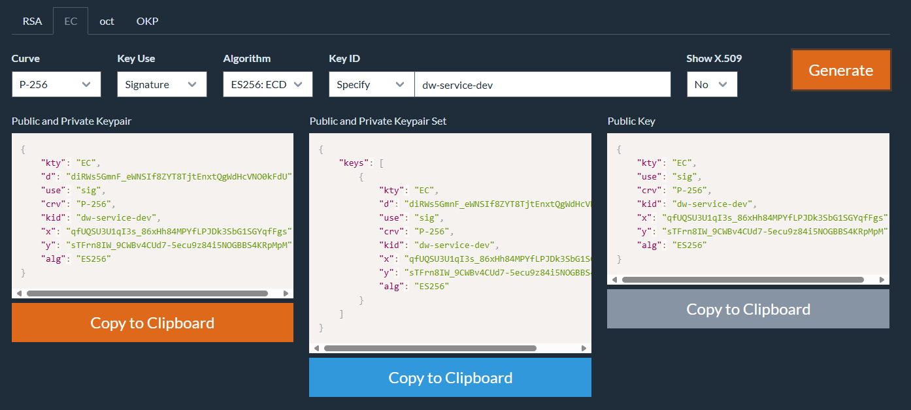
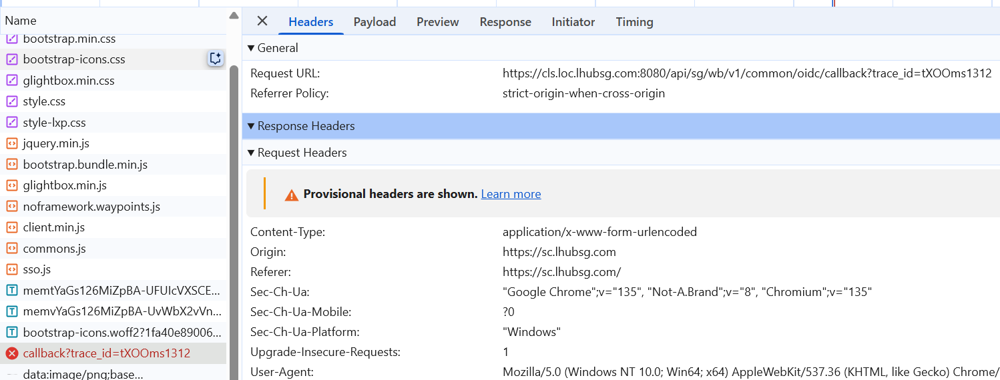
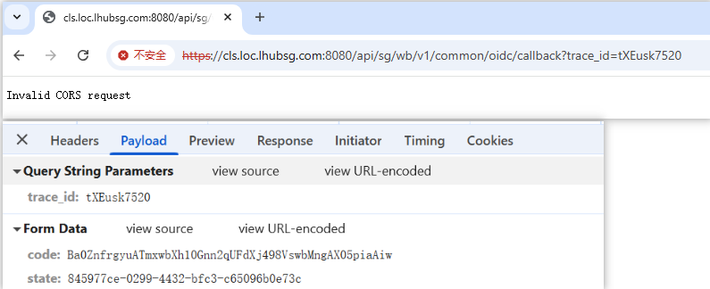

# ShopSphere
My Product

一、技术架构

后段

```
springboot 3.4.4
```

前端

```
react node-v:v23.11.0
```

部署

```
jenkins + docker
```

 二、后端开发


三、前端开发

```
npx create-react-app mall-admin-app
cd mall-admin-app
npm install axios,react-router-dom
```


四、部署


# 附录

## 1、测试账号

```
Admin:
            kaien.kim

Learners: 
            lxp-indiv-learner1
            lxp-indiv-learner2

            lxp-corp-learner1
            lxp-corp-learner2

Password: MxRt2@25zAq#
```


## 2、报错解决


### client assertion配置

配置private-key.pem

需求描述：

```
Note: We will be using client assertion which your end will sign the assertion
```

报错：

```
org.springframework.beans.factory.BeanCreationException: Error creating bean with name 'jwtEncoder' defined in class path resource [com/grey/sso/demo/config/SsoConfig.class]: Failed to instantiate [org.springframework.security.oauth2.jwt.JwtEncoder]: Factory method 'jwtEncoder' threw exception with message: keys\private-key.pem
```


#### 开发环境配置key

解决：使用下面这个开源、安全的 JWT / JWK 密钥生成器，支持各种算法（RSA, EC, HMAC）

```
https://mkjwk.org/
```



Public and Private Keypair

```
{
    "kty": "EC",
    "d": "diRWs5GmnF_eWNSIf8ZYT8TjtEnxtQgWdHcVNO0kFdU",
    "use": "sig",
    "crv": "P-256",
    "kid": "dw-service-dev",
    "x": "qfUQSU3U1qI3s_86xHh84MPYfLPJDk3SbG1SGYqfFgs",
    "y": "sTFrn8IW_9CWBv4CUd7-5ecu9z84i5NOGBBS4KRpMpM",
    "alg": "ES256"
}
```

上面内容存入：`src/main/resources/keys/private-key.pem`

Public Key

```
{
    "kty": "EC",
    "use": "sig",
    "crv": "P-256",
    "kid": "dw-service-dev",
    "x": "qfUQSU3U1qI3s_86xHh84MPYfLPJDk3SbG1SGYqfFgs",
    "y": "sTFrn8IW_9CWBv4CUd7-5ecu9z84i5NOGBBS4KRpMpM",
    "alg": "ES256"
}
```

将上面的 Public Key 发给sso team 的同事。只要你点击 SSO 登录页并授权，就能看到 `private-key.pem` 正式被用上


```
curl -vk "https://sc.lhubsg.com/sam/idp/a/lhubstg/oidc/auth?response_type=code&client_id=custom-funding-dev&scope=openid&state=ce6321a1-65ce-47a0-956a-1e28c46ff9d5&redirect_uri=https://cls.loc.lhubsg.com:8080/api/sg/wb/v1/common/oidc/callback&nonce=PFmvVQG9rvO6NEcjHSYBEewMbAe9O1-UAyvfDxosDVI"
```


#### 测试环境配置key

Public and Private Keypair

```
{
    "kty": "EC",
    "d": "MKSzOrgYIbGd8Tttblhpr_NVyYzrF8CuZCTn26GImBk",
    "use": "sig",
    "crv": "P-256",
    "kid": "custom-funding-chd",
    "x": "B0MLsBygaCo0sCrpB7cil_6Y3BRHOmPK-yb1kFGP79A",
    "y": "U56bj0KDilZdn8EA7Eo59G1avrXAzfC-p6B26VkACAc",
    "alg": "ES256"
}
```

上面内容存入：`src/main/resources/keys/private-key.pem`

Public Key

```
{
    "kty": "EC",
    "use": "sig",
    "crv": "P-256",
    "kid": "custom-funding-chd",
    "x": "B0MLsBygaCo0sCrpB7cil_6Y3BRHOmPK-yb1kFGP79A",
    "y": "U56bj0KDilZdn8EA7Eo59G1avrXAzfC-p6B26VkACAc",
    "alg": "ES256"
}
```

将上面的 Public Key 发给sso team 的同事。只要你点击 SSO 登录页并授权，就能看到 `private-key.pem` 正式被用上


### 配置https

问题描述：本地springboot 是通过http启动的，但是发给sso配置的callback url 是https的。

跳转到SSO 输入用户名和密码后，下面的url 报错：




#### 方案1、keytool生成自签名证书

开发环境使用

```
keytool -genkeypair -alias myapp -keyalg RSA -keysize 2048 -storetype PKCS12 -keystore keystore.p12 -validity 3650 -storepass changeit -dname "CN=cls.loc.lhubsg.com"
```

执行完以后，会生成

- 一个 `keystore.p12` 文件，放在当前目录
- 密码为：`changeit`
- 证书别名：`myapp`
- 有效期：10 年
- 主题：`CN=cls.loc.lhubsg.com`

将证书放到

```
src/main/resources/ssl/keystore.p12
```

修改 `application.yml` 启用 HTTPS

```
server:
  port: 8080            
  ssl:
    enabled: true
    key-store: classpath:ssl/keystore.p12
    key-store-password: changeit  # ${KEYSTORE_PASS}    走环境变量 
    key-store-type: PKCS12
```

 

访问地址变为：

```
https://localhost:8080/
https://localhost:8080/oauth2/authorization/lhubsso
```

 

#### 方案2、Chocolatey 生成签名证书

上面的解决方案出现了下面报错：




问题描述：

```
提供给sso 的redirect_uri  ： https://cls.loc.lhubsg.com:8080/api/sg/wb/v1/common/oidc/callback  

因此要求本地项目是https 启动的。

在上面项目配置了 https ，同时开启了 Spring Security 的 CORS 校验 时，如果 HTTPS 没有正确配置证书、Origin 未允许、或跳转流程不标准，就会导致 Invalid CORS request
```

浏览器不信任你的 `https://cls.loc.lhubsg.com:8080` 时 ，使用 [mkcert](https://github.com/FiloSottile/mkcert) 为 `cls.loc.lhubsg.com` 签发本地受信任证书


`keytool` VS   `mkcert`

| 特性           | 你的 keytool 命令                        | mkcert 推荐方式                  |
| -------------- | ---------------------------------------- | -------------------------------- |
| 是否被系统信任 | 否（自签名证书）                         | 是（被系统/浏览器信任的本地 CA） |
| 浏览器提示     | 会显示“不安全连接”                       | 无提示，浏览器直接接受           |
| Cookie 支持    | 可能被浏览器拦截                         | 可以正常发送带 Cookie 的跨域请求 |
| 是否推荐       | 不推荐用于浏览器请求（仅限测试内部服务） | 强烈推荐开发时使用               |

你用 keytool 生成的证书，Chrome 或 Edge 访问 `https://cls.loc.lhubsg.com:8080` 时会看到类似提示：

> 您的连接不是私密连接（NET::ERR_CERT_AUTHORITY_INVALID）

即使你接受风险继续访问，浏览器在跨域请求时还是不会发送 Cookie，这会导致 Spring Boot 登录失败，CORS 被拒绝，或：

```
Invalid CORS request
```

step1:  下载 Chocolatey ，重命名为：`mkcert.exe ` ，放到 `C:\Grey\Installs\mkcert`  中

```
https://github.com/FiloSottile/mkcert/releases
```

```
mkcert -install
```

为你的域名生成受信任的证书

```
mkcert cls.loc.lhubsg.com
```

提示如下

```
reated a new certificate valid for the following names 📜
 - "cls.loc.lhubsg.com"

The certificate is at "./cls.loc.lhubsg.com.pem" and the key at "./cls.loc.lhubsg.com-key.pem" 

It will expire on 25 July 2027 
```

会生成两个文件：

- `cls.loc.lhubsg.com.pem`：证书
- `cls.loc.lhubsg.com-key.pem`：私钥

将 `.pem` 证书转换为 Spring Boot 可用的 `.p12`

```
openssl pkcs12 -export ^
  -in cls.loc.lhubsg.com.pem ^
  -inkey cls.loc.lhubsg.com-key.pem ^
  -out  cls-lhubsg-mkcert.p12 ^
  -name tomcat ^
  -CAfile "%LOCALAPPDATA%\mkcert\rootCA.pem" ^
  -caname rootCA
```

这就是 `.p12` 的密码，Spring Boot 配置中你需要填写同样的密码，例如 `changeit`


需要先安装 openssl

```
https://slproweb.com/products/Win32OpenSSL.html
```

安装后将其配置到环境变量

```
C:\Program Files\OpenSSL-Win64\bin
```

```
openssl version
```

将生成的 `cls-lhubsg-mkcert.p12` 放到`src/main/resources/ssl` 

对应的配置如下，之前通过 keytool 生成的keystore.p12不需要保留了

```
server:
  port: 8080
  ssl:
    enabled: true
    key-store: classpath:cls-lhubsg-mkcert.p12   
    key-store-password: changeit                
    key-store-type: PKCS12
    key-alias: tomcat                         
```

在部署测试环境或内网服务，`mkcert` 是极佳选择；但若你部署的是面向用户的公网服务，必须使用权威 CA 签发的证书
